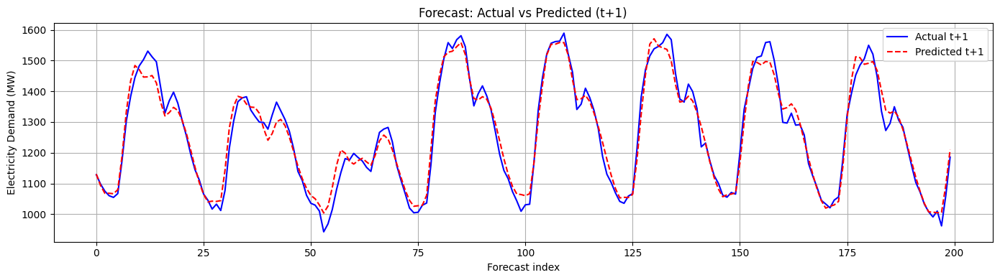

# Electricity Load Forecasting using GRU + Attention

This project builds a deep learning model (GRU + Attention) to predict short-term electricity demand using historical weather and demand data.

## Dataset
- Public dataset from Kaggle: [Electricity Load Forecasting Dataset](https://www.kaggle.com/datasets/saurabhshahane/electricity-load-forecasting)
- Features include: temperature, humidity, wind speed, holiday information, and demand history.

## Model
- Input: 48 hours of past data with 20 features
- Output: Forecast next 1 hour of demand
- Makes use of PyTorch library

## Results
- Test Accuracy (t+1): 94.8%
- Test MSE (t+1): 3594.75

